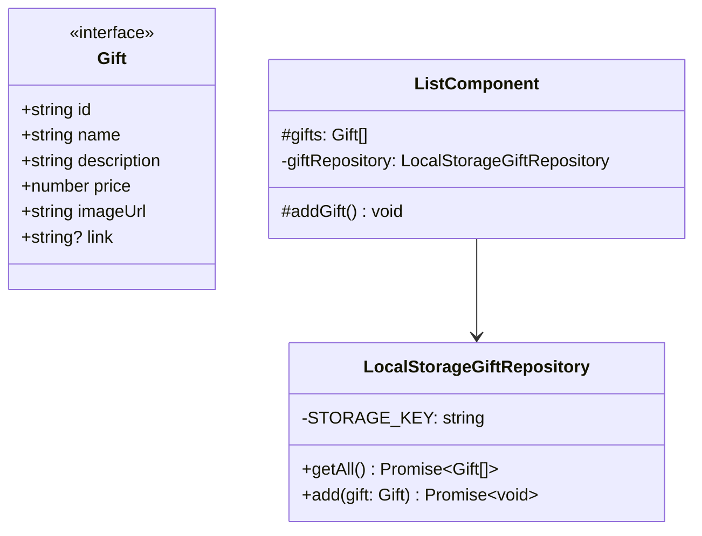

```mermaid
classDiagram
  class Gift {
    <<interface>>
    +string id
    +string name
    +string description
    +number price
    +string imageUrl
    +string? link
  }

class LocalStorageGiftRepository {
  -STORAGE_KEY: string
  +getAll() Promise~Gift[]~
  +add(gift: Gift) Promise~void~
}

class ListComponent {
  #gifts: Gift[]
  -giftRepository: LocalStorageGiftRepository
  #addGift() void
}
ListComponent --> LocalStorageGiftRepository
```
