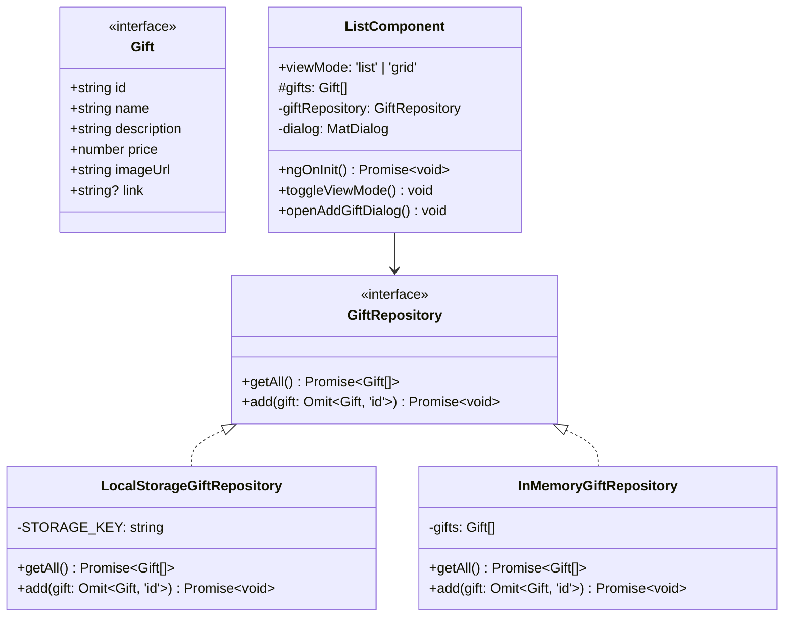

```mermaid
classDiagram
  class Gift {
    <<interface>>
    +string id
    +string name
    +string description
    +number price
    +string imageUrl
    +string? link
  }

  class GiftRepository {
    <<interface>>
    +getAll() Promise~Gift[]~
    +add(gift: Omit~Gift, 'id'~) Promise~void~
  }


  class LocalStorageGiftRepository {
    -STORAGE_KEY: string
    +getAll() Promise~Gift[]~
    +add(gift: Omit~Gift, 'id'~) Promise~void~
  }

  class InMemoryGiftRepository {
    -gifts: Gift[]
    +getAll() Promise~Gift[]~
    +add(gift: Omit~Gift, 'id'~) Promise~void~
  }

  class ListComponent {
    +viewMode: 'list' | 'grid'
    #gifts: Gift[]
    -giftRepository: GiftRepository
    -dialog: MatDialog
    +ngOnInit() Promise~void~
    +toggleViewMode() void
    +openAddGiftDialog() void
  }

  GiftRepository <|.. LocalStorageGiftRepository
  GiftRepository <|.. InMemoryGiftRepository
  ListComponent --> GiftRepository
```
